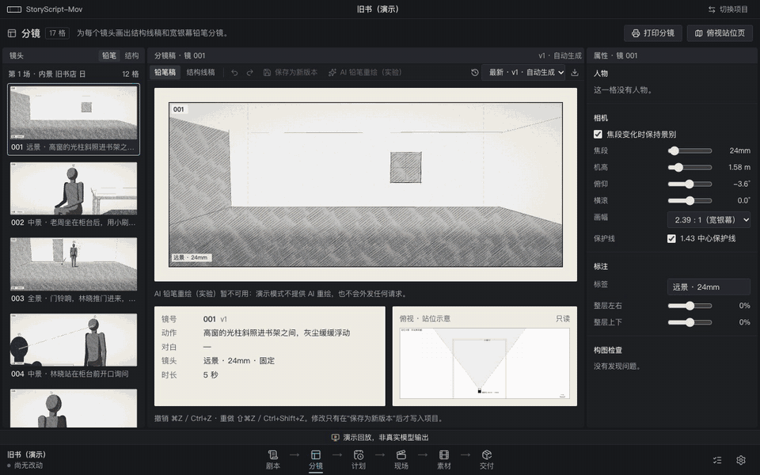
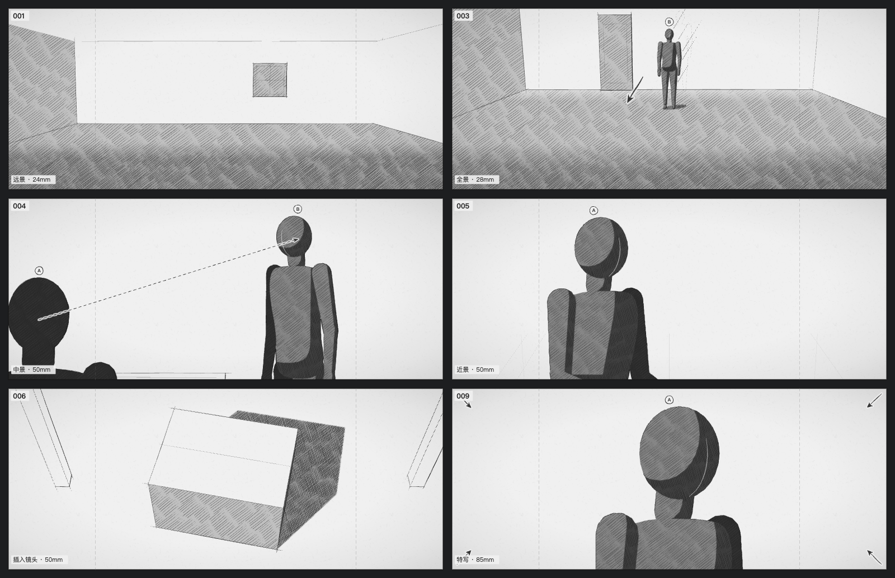
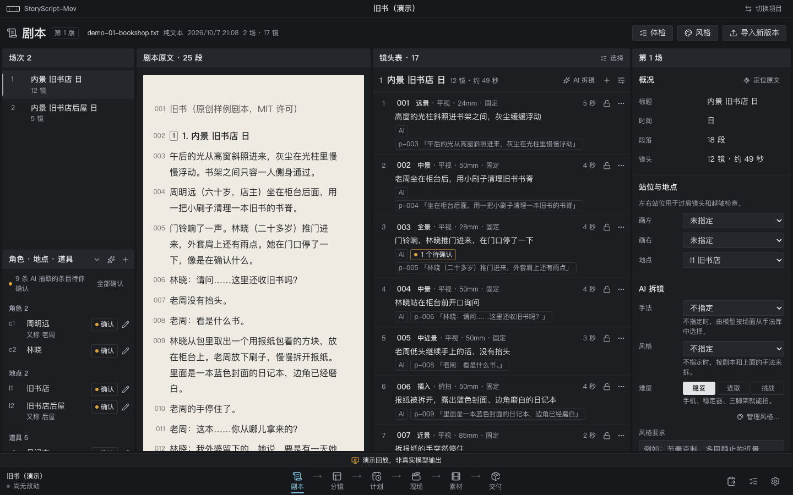
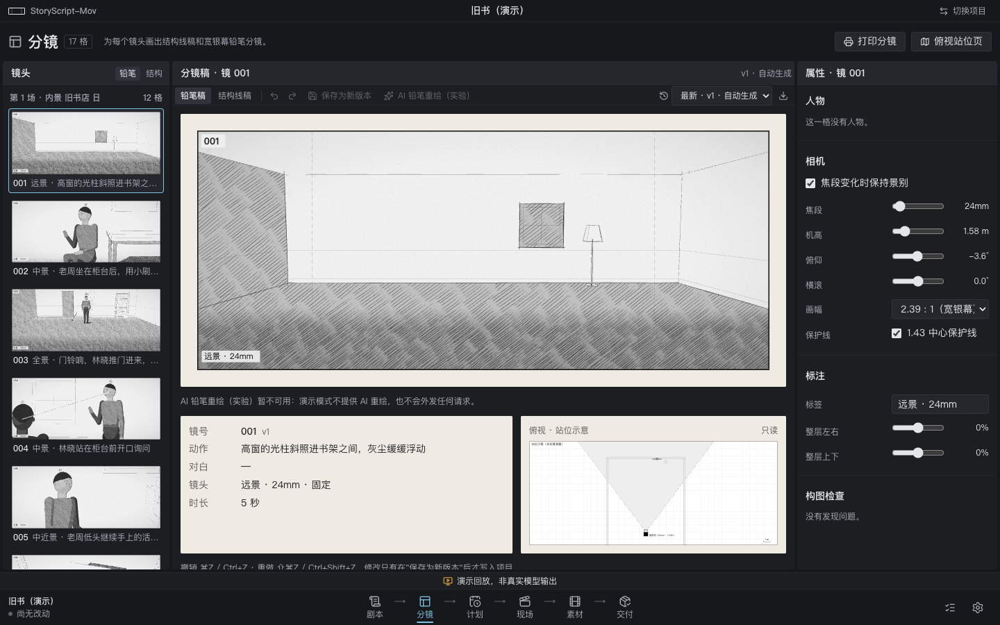
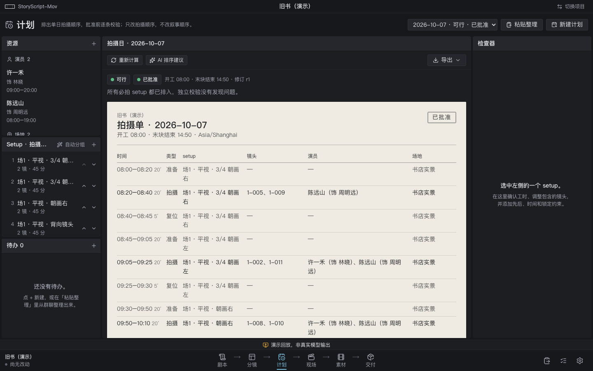
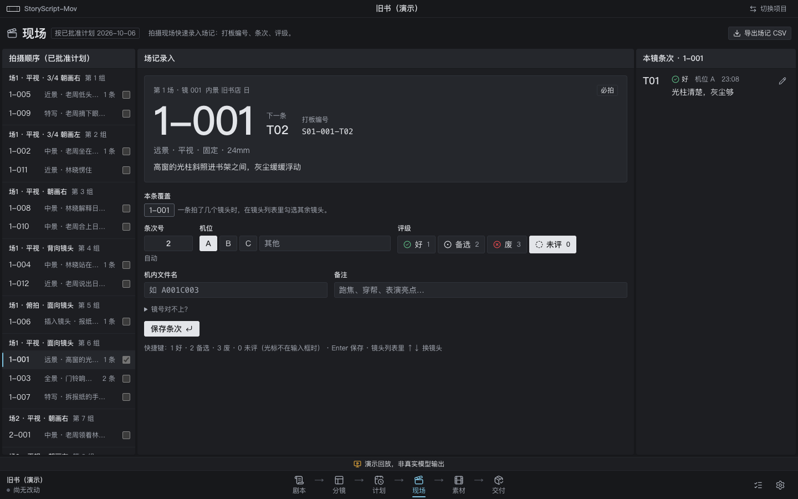
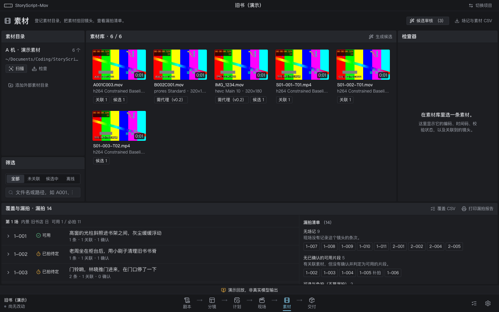
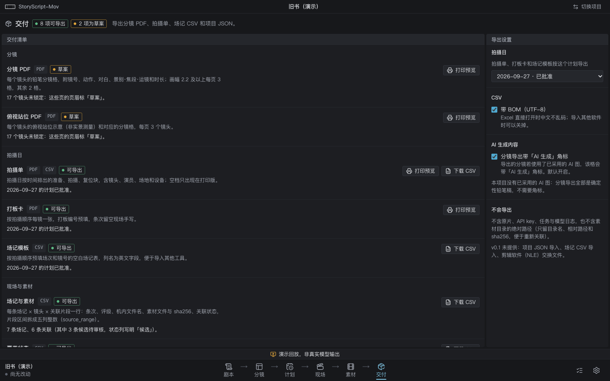

# StoryScript-Mov


An open-source, **local-first storyboard workbench for live-action shoots**. It breaks a script into a lockable, source-linked shot list, and automatically draws each shot as a widescreen pencil storyboard with real lens and camera-height semantics — no API key required. It also builds a validated shooting order, lets you log takes quickly on set, and links the footage back to the same shot IDs so you can see coverage gaps at a glance.

> **v0.1 developer preview.** Not yet validated on a real shoot. Chinese is the primary UI and documentation language; see [README.md](README.md) for the full Chinese guide and version history.



## Highlights

- **Script → shots.** Paste or import `.txt` / `.md` / `.fountain`. Scenes are split by heading rules, and every paragraph gets an anchor. AI breakdown produces a *draft* that you review item by item; each shot quotes the script, and shots whose quote doesn't match the script cannot be applied. Locked shots are never touched by AI. Everything works without a key.
- **Widescreen pencil boards out of the box.** A world-space pinhole-camera model lays out each shot, so focal length, camera height and pitch carry real meaning, and the frame and the top-view blocking diagram come from the same data. A deterministic pencil renderer lays down tones first and then contours: directional hatching and tapered outlines. Drag subjects and arrows, undo, keep versions, and export a storyboard PDF or a single-frame PNG.

  

- **Shooting order you can trust.** Setups are grouped automatically. Every schedule passes an independent validator, and the app only calls a day infeasible for explicit contradictions, with the evidence attached. LLM order suggestions are validated before you can adopt them, and only a validated plan can be approved. Export call sheets, slate cards and prefilled camera-log templates.
- **Find it after the shoot.** Log takes fast on set. Import footage read-only (ffprobe metadata, posters, SHA-256 with change detection). Link candidates from slate codes, clip names or your own regex, and confirm each one yourself. A coverage and missing-shot report covers every shot, including inserts and shots without dialogue.
- **AI pencil redraw (experimental, bring your own key).** Uses the structure board as a reference image. Results are candidates only: compare them with an onion-skin overlay, adopt one by hand, and exports carry an "AI generated" badge.

## Screenshots

All images come from the `npx storyscript-mov --demo` project and are generated by `npm run readme:media`; nothing is staged by hand.

| Script and shot list | Boards |
|---|---|
|  |  |
| **Shooting plan** | **On set** |
|  |  |
| **Footage and coverage** | **Deliver** |
|  |  |

## Quick start

Requires **Node.js ≥ 24.15**; ffmpeg/ffprobe are optional, needed only for importing footage.

```bash
npx storyscript-mov          # opens http://127.0.0.1:<port>/#t=<one-time token>
npx storyscript-mov --demo   # demo project, no key needed
npx storyscript-mov doctor   # environment check
```

From source:

```bash
git clone https://github.com/ChromiteCr/StoryScript-Mov.git storyscript-mov
cd storyscript-mov
npm ci
npm start
```

## Server mode (several teams, one site)

For a class, club or short-film festival you can host it on a server: each team signs in with a team code or invite link and gets its own project. Scripts, shots, boards, plans and camera logs live on the server; footage is never uploaded. See [docs/SERVER.md](docs/SERVER.md) (Chinese). Each member opens their project folder (e.g. A-roll/B-roll subfolders) in the browser: facts and small posters are read locally and sent, videos stay on their computer and play from there. The local single-user app is unchanged.

## Models (bring your own key)

- **Text:** any OpenAI chat-completions-compatible endpoint. Set `base_url`, key and model in Settings, or via `STORYSCRIPT_LLM_*` environment variables.
- **Images:** the request style is auto-detected from the host. OpenAI `/images/edits` is the default; there are presets for Volcengine Seedream and OpenRouter. All combinations are currently **unverified**; see [docs/providers.md](docs/providers.md).

Keys stay on your machine, in `~/.config/storyscript-mov/credentials.json` (mode 0600) or your environment.

## Inspiration

The widescreen pencil look is inspired by the loose pencil action storyboards found in published film screenplay books. This project is not affiliated with, endorsed by, or authorized by Christopher Nolan, his storyboard artists, Syncopy, Warner Bros. or IMAX Corporation. The repository contains no original storyboards, stills or tracings.

## License

[MIT](LICENSE)
